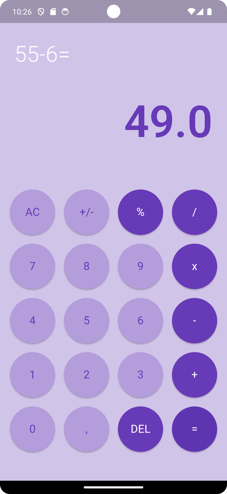

# Calculadora Flutter

Um aplicativo de calculadora simples desenvolvido usando Flutter. Este projeto foi criado para fins de aprendizado e prática.

## Capturas de Tela

## Recursos

- Operações aritméticas básicas: adição, subtração, multiplicação, divisão.
- Botão Limpar (`AC`) para redefinir o cálculo.
- Botão Apagar (`DEL`) para remover o último dígito.
- Exibe a expressão atual e o resultado dinamicamente.

## Estrutura do Projeto

- `main.dart`: Ponto de entrada da aplicação.
- `calculator.dart`: Contém a lógica principal da calculadora e a interface do usuário.
- `widgets/buttons.dart`: Widget de botão personalizado.
- `widgets/display_widget.dart`: Widget de exibição para mostrar a expressão e o resultado.
